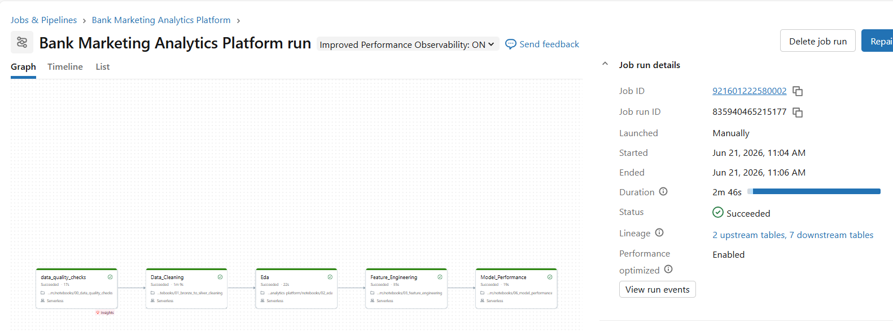
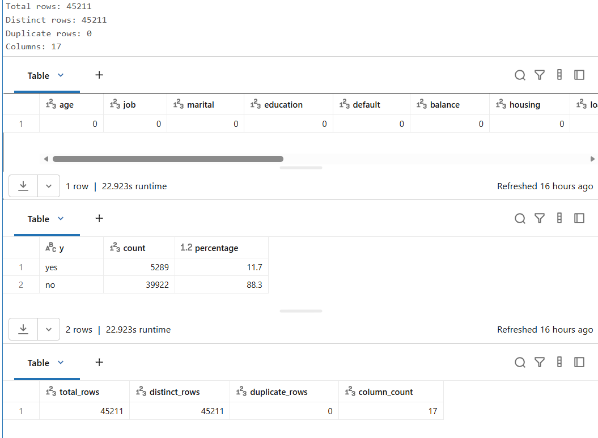
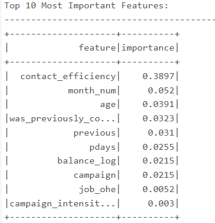
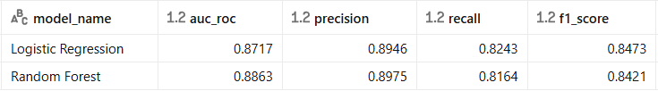
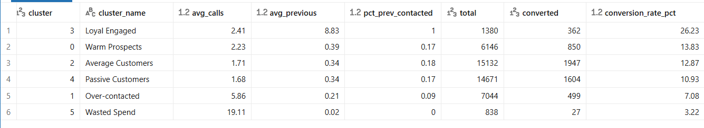
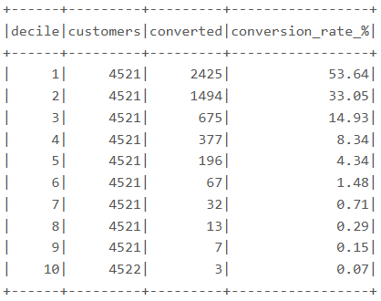

# Bank Marketing Analytics Platform

## Overview

A Portuguese bank was spending millions on telemarketing campaigns but converting only a small percentage of customers into term-deposit subscribers.

The challenge was not collecting more data—it was identifying:

- Which customers are most likely to subscribe
- Which campaigns generate the highest conversion rates
- Which customer segments should be prioritized
- Where marketing spend is being wasted

This project builds an end-to-end analytics platform using Databricks, PySpark, Delta Lake, Machine Learning, and Workflow Orchestration to transform raw campaign data into actionable business insights.

---

## Business Problem

The bank's marketing team was contacting thousands of customers without a clear targeting strategy.

Key challenges included:

- Low overall conversion rate (11.7%)
- Inefficient campaign timing
- Excessive customer contact attempts
- Lack of customer prioritization
- No data-driven segmentation strategy

The goal was to build a scalable analytics platform capable of:

1. Identifying high-value customer segments
2. Predicting customer subscription probability
3. Optimizing campaign targeting
4. Reducing marketing waste
5. Improving campaign ROI

---

## Dataset

**Source:** UCI Bank Marketing Dataset

| Metric | Value |
|----------|----------|
| Records | 45,211 |
| Features | 17 |
| Positive Conversions | 5,289 |
| Baseline Conversion Rate | 11.7% |

---

## Solution Architecture

The platform follows a Medallion Architecture implemented in Databricks.

```text
Raw Dataset
      │
      ▼
 Bronze Layer
      │
      ▼
 Silver Layer
(Data Cleaning + Validation)
      │
      ▼
 Gold Layer
(Feature Engineering)
      │
      ▼
 Machine Learning
      │
      ▼
 Customer Segmentation
      │
      ▼
 Business Reporting
```

---

## Workflow Orchestration

The entire pipeline is orchestrated using Databricks Workflows.

The workflow automates:

- Data quality validation
- Data cleaning
- Exploratory analysis
- Feature engineering
- Model performance reporting



---

## Data Quality Validation

Before any analytics or machine learning, the dataset is validated for consistency and completeness.

Validation checks include:

- Duplicate detection
- Missing value validation
- Target distribution validation
- Dataset profiling

### Results

- 45,211 records validated
- 0 duplicate records detected
- 0 critical missing values
- 17 business attributes analyzed



---

## Feature Engineering

Several business-focused features were engineered to improve model performance.

Examples include:

- Contact efficiency
- Campaign intensity
- Previous campaign engagement
- Balance transformations
- Temporal campaign attributes

### Most Important Features

The machine learning model identified the following features as the strongest predictors of customer conversion:



### Key Finding

Contact efficiency was the strongest predictor of subscription likelihood, followed by campaign timing and previous customer engagement.

---

## Machine Learning

Two classification models were trained using PySpark MLlib:

- Logistic Regression
- Random Forest

### Model Performance

| Model | AUC-ROC | Precision | Recall | F1 Score |
|---------|---------|---------|---------|---------|
| Logistic Regression | 0.8717 | 0.8946 | 0.8243 | 0.8473 |
| Random Forest | 0.8863 | 0.8975 | 0.8164 | 0.8421 |



### Selected Model

Random Forest achieved the highest AUC-ROC and was selected for customer propensity scoring.

---

## Customer Segmentation

K-Means clustering was applied to identify distinct customer groups based on campaign behavior and customer characteristics.

### Segment Summary

| Segment | Customers | Conversion Rate |
|----------|----------:|----------:|
| Loyal Engaged | 1,380 | 26.23% |
| Warm Prospects | 6,146 | 13.83% |
| Average Customers | 15,132 | 12.87% |
| Passive Customers | 14,671 | 10.93% |
| Over-contacted | 7,044 | 7.08% |
| Wasted Spend | 838 | 3.22% |



### Key Findings

#### Loyal Engaged

- Highest conversion rate (26.23%)
- 100% previously contacted customers
- Strongest segment for future targeting

#### Warm Prospects

- Above-average conversion performance
- Good candidates for future campaigns

#### Wasted Spend

- Lowest conversion rate (3.22%)
- Extremely high average contact frequency
- Strong indication of marketing inefficiency

---

## Propensity Scoring and Decile Analysis

Customers were ranked by predicted probability of conversion.

The ranked customer list enables marketing teams to prioritize outreach toward the highest-value customers.



### Results

| Decile | Conversion Rate |
|----------|----------:|
| Top 10% | 53.64% |
| Bottom 10% | 0.07% |

### Business Impact

The highest-probability customers converted more than 750 times better than the lowest-probability customers.

This demonstrates the value of targeted campaigns compared to blanket outreach strategies.

---

## Business Insights

### Campaign Timing Matters

Most calls were placed during May despite relatively low conversion performance.

Several lower-volume months achieved significantly higher conversion rates and represent opportunities for improved budget allocation.

### Contact Fatigue Exists

Conversion rates declined rapidly after three contact attempts.

Repeated outreach generated diminishing returns and increased marketing costs.

### Previous Success Predicts Future Success

Customers who responded positively to previous campaigns were significantly more likely to subscribe again.

These customers should be prioritized in future campaigns.

### Resource Optimization

The combination of machine learning and customer segmentation enables:

- Better campaign targeting
- Reduced marketing waste
- Improved customer prioritization
- Higher conversion efficiency

---

## Technology Stack

| Layer | Technology |
|---------|------------|
| Processing | PySpark |
| Analytics Platform | Databricks |
| Storage | Delta Lake |
| Workflow Orchestration | Databricks Workflows |
| Machine Learning | PySpark MLlib |
| Customer Segmentation | K-Means |
| Data Quality | PySpark Validation Framework |
| Version Control | Git |
| Repository Hosting | GitHub |
| CI/CD | GitHub Actions |

---

## Project Structure

```text
bank-marketing-analytics-platform/
│
├── notebooks/
│   ├── 00_data_quality_checks
│   ├── 01_bronze_to_silver_cleaning
│   ├── 02_eda
│   ├── 03_feature_engineering
│   ├── 04_ml_training
│   ├── 05_kmeans
│   └── 06_model_performance
│
├── screenshots/
│   ├── workflow_pipeline.png
│   ├── data_quality_checks.png
│   ├── feature_importance.png
│   ├── model_performance.png
│   ├── customer_segmentation.png
│   └── decile_analysis.png
│
├── .github/
│   └── workflows/
│
└── README.md
```

---

## Key Outcomes

The platform successfully demonstrates:

- End-to-end data engineering on Databricks
- Data quality validation and monitoring
- Feature engineering using PySpark
- Machine learning-based customer propensity scoring
- Customer segmentation using K-Means clustering
- Workflow orchestration using Databricks Workflows
- CI/CD integration using GitHub Actions

Most importantly, the project shows how data engineering and machine learning can be combined to improve campaign targeting, reduce marketing waste, and support data-driven decision making.

---

## Dataset

UCI Machine Learning Repository – Bank Marketing Dataset

https://archive.ics.uci.edu/ml/datasets/bank+marketing
